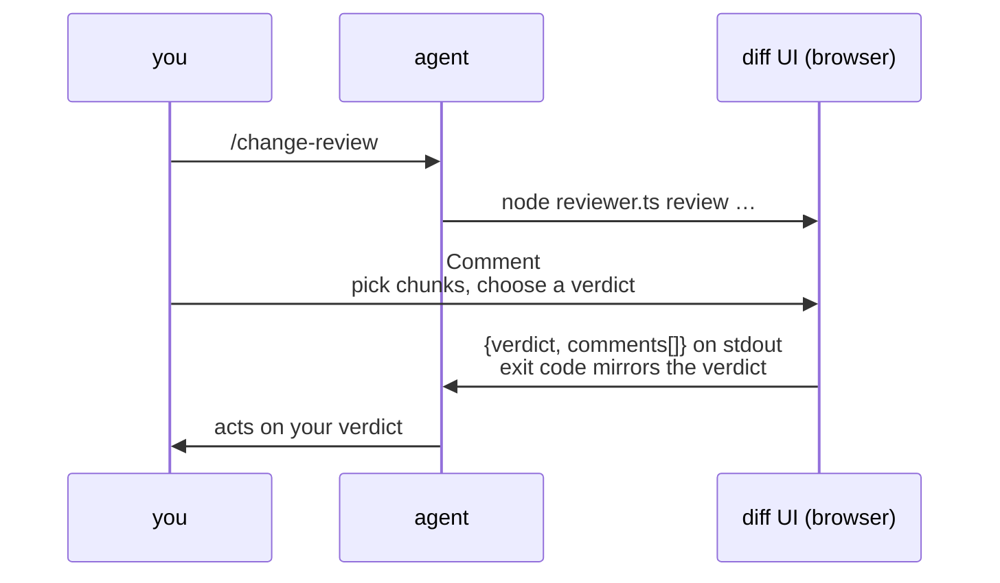
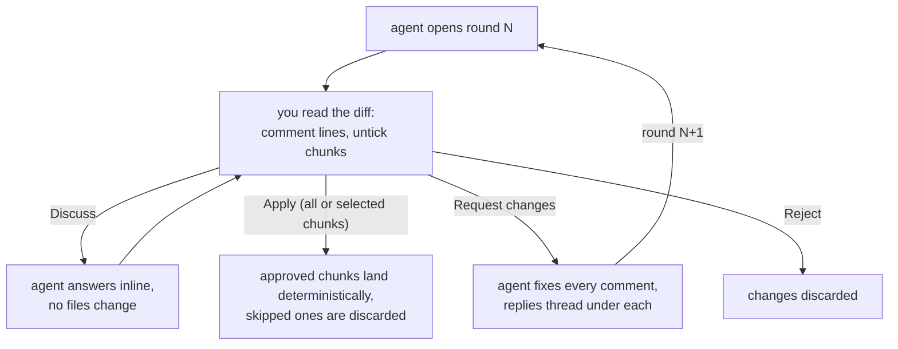

# change-review

**Code review for AI coding agents — with you as the reviewer.** Your agent proposes a change, your browser opens a GitHub-style inline diff, and your verdict and comments go straight back to the agent as JSON.




Agents write diffs faster than anyone can read them in a terminal. change-review turns the wall of scrolling green text into a review you can actually do:

- **A real diff UI** — inline, in your browser. Hover a line, click `+`, comment.
- **Apply only what you approve** — every chunk has a checkbox in the gutter. Untick the parts you don't want; **Apply** lands exactly the rest.
- **Discuss before you decide** — send your comments to the agent mid-review; its replies thread inline, as many turns as you need.
- **Rounds, not restarts** — on **Request changes** the agent resubmits to the same review, its replies threaded under your comments. Earlier rounds stay browsable; a ⇄ view diffs any two revisions.
- **Start from the code, not the diff** — `--file` opens existing files for line comments before anything is written. Your annotations become the spec; the agent's edits arrive as round 2 of the same review.
- **Nothing to babysit** — the review server outlives the agent's command, so a verdict is never lost to a timeout. Zero runtime dependencies, one self-contained HTML file, binds `127.0.0.1` only.

## Install

```bash
npx skills add marinsokol5/change-review    # Claude Code, Codex, …

npx skills update change-review             # later, to pull updates
```

Requires **Node >= 22.18**: the CLI is TypeScript that `node` runs directly, so there is no build step and no `npm install`. Restart your agent session so it picks the skill up.

## Usage

You don't run the CLI — your agent does. You just ask:

| you say                                                 | what opens                                                                          |
| ------------------------------------------------------- | ----------------------------------------------------------------------------------- |
| *"Open a review before you apply that."*                | the proposed change, before it touches your files                                   |
| *"Show me the diff."* / *"Let me review what you did."* | the changes the agent just made to your working tree                                |
| *"Open a review of the last commit."*                   | any git range, piped in as a patch                                                  |
| *"Let me annotate src/auth.py."*                        | the file as-is — your comments become the spec, the agent's fixes arrive as round 2 |

The skill also tells agents to open a review on their own before substantive or risky changes. Want every change gated? Add one line to your project's `CLAUDE.md` / `AGENTS.md`: *"Open a change-review before landing any edit."*

In the review: hover a line and click `+` to comment, untick the chunks you don't want, then **Apply**, **Request changes**, or **Discuss**. Take your time — the review outlives the agent's command, and the agent picks your verdict up when you're done.

## How it works

The agent runs `node <skill-dir>/scripts/reviewer.ts review` with `--worktree` (review uncommitted changes), `--proposal <dir>` (review *before* anything is written — on approve the CLI itself writes the reviewed bytes, sha256-verified, all-or-nothing, filtered to your chunk selection), `--file <path>` (annotate existing code), or any unified diff. The command blocks until you decide:

```json
{
  "verdict": "request_changes",
  "summary": "Direction is right, two fixes needed.",
  "comments": [
    { "file": "src/auth.py", "side": "new", "line": 42, "body": "use the existing retry helper here" }
  ],
  "session": "2026-06-11-a1b2c3",
  "round": 1
}
```

Exit codes mirror the verdict: `0` approve · `2` request_changes · `3` reject · `4` pending · `5` discussion · `1` error.



A partial Apply never depends on the model getting an edit right: the verdict ships ready-made `appliedPatch`/`revertPatch` files and the agent just runs `git apply` — and in proposal mode the CLI writes the approved bytes itself. Skipped chunks are removed deterministically, not re-typed.

Sessions live in a temp directory the agent picks (`--dir`); nothing is written to fixed global paths. The UI server runs detached, so when the agent's command times out the review just keeps waiting — by default the agent ends its turn and picks the verdict up when you're done (`config wait-mode poll` makes it wait in a loop instead). Draft comments persist in localStorage, so a closed tab loses nothing.

- **[SKILL.md](skills/change-review/SKILL.md)** — the full agent contract (commands, JSON shapes, exit codes)
- **[AGENTS.md](AGENTS.md)** — development guide (architecture, invariants, how to test)

## License

[MIT](LICENSE)
